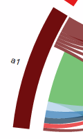
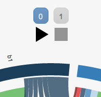
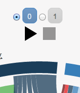

# A Circular Plot library in D3.js

## Rationale

The idea behind this repo is to provide an easy setup and all the documentation necessary to
set a circular plot up starting from a set of observations in a CSV file.

## Origins and Credits

The code is directly copied from [Null2](http://null2.net/)'s [implementation](https://github.com/null2/globalmigration)
in [D3.js](https://d3js.org). We strive not to diverge from that code base and so we try to feed the original repo back
whenever we think some extensions, cleanup or fixes are needed.
We have done so via some Pull Requests.

## Getting up and running fast

This part details how to generate the supporting `JSON` files for the circular plot library
for the use case of the PRU studies of [intra](http://ansperformance.eu/studies/flows-extra/)
and [extra](http://ansperformance.eu/studies/flows-intra/) flows of flights in Europe.

The support files are the ones generated by the R code as described in the
[flowsr](https://github.com/espinielli/flowsr) repo.
These, all the ones ending in `-viz.csv` in the `data` directory, 
need to be copied in the `data` directory of this repo.

Then by simply executing

```shell
$ npm run doit
```

two `JSON` files will be produced in the `json` directory.

Run an http server 

```shell
$ python -m SimpleHTTPServer 8989
```

and brose http://localhost:8989/


## Data preparation for the general case

**NOTE**: this is WORK IN PROGRESS.

`Origin` (`destination`) is something like an airport, while `origingroup` (`destinationgroup`) is something like its
country.

We start from a test CSV file `test_data.csv.orig` logically organized as follows:

| time | origin | origingroup | destination | destinationgroup | measure |
|------|--------|-------------|-------------|------------------|---------|
|    0 |  a1    |  a          |  b2         |  b               |  17     |
|    0 |  a1    |  a          |  b3         |  b               |  19     |
|  ... |  ...   |  ...        |  ...        |  ...             |  ...    |
|    1 |  a1    |  a          |  b3         |  b               |  191    |


Transform `test_data.csv.orig` headings to the ones expected by `csv2flowmatrix.js`:

```bash
$ bin/gen_flows
```


Get the list of origins/destinations:

```bash
$ cat \
    <(echo 'iso,name,show') \
    <(sort \
        <(cat data/test_data.csv.orig | tail --lines=+2 | grep -E -v '^[[:space:]]*$' | cut -d, -f2) \
        <(cat data/test_data.csv.orig | tail --lines=+2 | grep -E -v '^[[:space:]]*$' | cut -d, -f4) \
        | uniq | sed -e 's/^\(.*\)$/\1,\1,1/g') > data/test_countries.csv
```


Get the list of origingroups/destinationgroups:

```bash
$ cat \
    <(echo 'name') \
    <(sort \
        <(cat data/test_data.csv.orig | tail --lines=+2 | grep -E -v '^[[:space:]]*$' | cut -d, -f3) \
        <(cat data/test_data.csv.orig | tail --lines=+2 | grep -E -v '^[[:space:]]*$' | cut -d, -f5) \
       | uniq) > data/test_regions.csv
```


Get all the years:

```bash
$ cat \
    <(echo 'year') \
    <(sort \
        <(cat data/test_data.csv.orig | tail --lines=+2 | grep -E -v '^[[:space:]]*$' | cut -d, -f1) \
       | uniq) > data/test_years.csv
```


All these steps are performed by the script `gen_test_data` and the test data can be generated via npm:

```bash
$ npm run -s compile:test
```

This prepares 4 input files:

1. `test_data.csv`, the _observation_ table in CSV format.

   |  A   |  B   |  C   |  D   |  E   |  F  |   G  | H    |
   |------|------|------|------|------|-----|------|------|
   |  a1  |  a   |  b2  |  b   |  a1  |  b2 |  17  | 101  |
   |  a1  |  a   |  b3  |  b   |  a1  |  b3 |  19  | 111  |
   |  ... |  ... |  ... |  ... |  ... | ... |  ... |  ... |
   |  c1  |  c   |  c3  |  c   |  c1  |  c3 |  191 | 1141 |

   where
   * `A` = `origin_iso`
   * `B` = `originregion_name`
   * `C` = `destination_iso`
   * `D` = `destinationregion_name`
   * `E` = `origin_name`
   * `F` = `destination_name`
   * `G` = `countryflow_0`
   * `H` = `countryflow_1`


2. `test_countries.csv`, the CSV file with the measurement entities (countries) in the dataset
   and a boolean (set to 1 by the script) to say whether they are to be shown (`1` = SHOW, `0` = HIDE).

    | iso | name | show |
    |-----|------|------|
    | a1  |  a1  |  1   |
    | a2  |  a2  |  1   |
    | ... | ...  |  ... |
    | c4  | c4   |  1   |

3. `test_regions.csv`, the CSV file with the group component (regions) in the dataset.

    | name |
    |------|
    |   a  |
    |   b  |
    |   c  |

4. `test_years.csv`, the CSV file with the time component (years) in the dataset

    | year |
    |------|
    |  0   |
    |  1   |


And produces a JSON file that will be loaded by the HTML file.

This JSON file has 3 properties:

1. `names`, the array of the names of the entities.
    For the test data it is an array of 11 names:

    ```
    ["a","a1","a2","b","b1","b2","b3","c","c1","c2","c3","c4"]
    ```

2. `regions`, the pointers to the names of the regions.
    For the test data it is an array of indexes to the `names` array:

    ```
    [0,3,7]
    ```

    So the entry at position `0`, `3` and `7` in the `names` array are regions (and the others are countries).
    This scheme let us find the name of the region, for example **b** is `names[regions[1]]` and the countries that belong to the region, i.e. the indexes between region and next one (of end of the array of names).

3. `matrix`, and object with a matrix for every time component (year).
    The matrix describes the relationships between each of the entities (countries and regions).

    For example for the first time component, `0`, in the test data we have the following
    square matrix:

    |         |   a  |  a1  |  a2  |   b  |  b1  |  b2  |  b3  |   c  |  c1  |  c2  |  c3  |  c4  |
    |--------:|-----:|-----:|-----:|-----:|-----:|-----:|-----:|-----:|-----:|-----:|-----:|-----:|
    |  **a**  |  504 |  250 |  254 |  816 |  264 |  272 |  280 | 1258 |  300 |  310 |  318 |  330 |
    |  **a1** |  204 |  101 |  103 |  329 |  107 |  109 |  113 |  534 |  127 |  131 |  137 |  139 |
    | **a2**  |  300 |  149 |  151 |  487 |  157 |  163 |  167 |  724 |  173 |  179 |  181 |  191 |
    |  **b**  | 1482 |  727 |  755 | 2363 |  767 |  787 |  809 | 3404 |  829 |  843 |  861 |  871 |
    | **b1**  |  390 |  193 |  197 |  633 |  199 |  211 |  223 |  928 |  227 |  229 |  233 |  239 |
    | **b2**  |  492 |  241 |  251 |  789 |  257 |  263 |  269 | 1112 |  271 |  277 |  281 |  283 |
    | **b3**  |  600 |  293 |  307 |  941 |  311 |  313 |  317 | 1364 |  331 |  337 |  347 |  349 |
    |  **c**  | 3508 | 1744 | 1764 | 5482 | 1796 | 1830 | 1856 | 7640 | 1876 | 1900 | 1920 | 1944 |
    | **c1**  |  712 |  353 |  359 | 1119 |  367 |  373 |  379 | 1570 |  383 |  389 |  397 |  401 |
    | **c2**  |  828 |  409 |  419 | 1285 |  421 |  431 |  433 | 1788 |  439 |  443 |  449 |  457 |
    | **c3**  |  924 |  461 |  463 | 1433 |  467 |  479 |  487 | 2002 |  491 |  499 |  503 |  509 |
    | **c4**  | 1044 |  521 |  523 | 1645 |  541 |  547 |  557 | 2280 |  563 |  569 |  571 |  577 |

    The columns heading are the *destinations*, while the row ones are the *origins*.
    The cell for the 3rd row, **a2**, and the **c** column contains `724`.

    If the entities with numbers are countries, i.e. **b3**, the ones without are regions, i.e. *a*, and the values represent flights, then the cell above says there are 724 flights going from country **a2** to region **c**.


## The Parts of the Plot

The aim of this part is to describe the 3 different blocks of the graph and to detail how they can be customized via
the configuration parameters, CSS and/or javascript.

The three parts are instantioated as follows

```js
(function() {
  var datafile = 'json/test_data.json';
  d3.json(datafile, function(error, data) {
    if (error) throw error;

    var chartConfig = { ... },
        timelineConfig = { ... },
        playtimeConfig = { ... };

    var chart = Globalmigration.chart(data, chartConfig);
    Globalmigration.timeline(chart, timelineConfig);
    Globalmigration.playtime(playtimeConfig);

    chart.draw(now);
  });
})();
```

The relevant code for the plot is wrapped in an [Immediatelly-Invoked Function Expression](iife)

```js
(function() {
  ... // plot code (any code as a matter of fact)
})();
```

which garantees isolation from the rest of the javascript loaded by the HTML page.
This avoid variable hoisting from within blocks, protects against polluting the global environment and simultaneously allows public access to methods while retaining privacy for variables defined within the function. See also [ the relevant article on Wikipedia](iife-wiki).

[iife]: <http://benalman.com/news/2010/11/immediately-invoked-function-expression/> "Immediatelly-Invoked Function Expression"
[iife-wiki]: <https://en.wikipedia.org/wiki/Immediately-invoked_function_expression> "Wikipedia: Immediatelly-Invoked Function Expression"


### The Circle

The circular plot below is a representation of the content of the matrix above (note that the `a` region is not expanded).


Origins and destinations are represented by the circle’s segments proportional to the the sum of their in/out flows.

Each entity (region/country) is assigned a colour. The colours are configurable via the `colors` property of the `config.layout` object, see [Configurations](#configurations) section below.


Flows have the same colour as their origin and the width indicates their size.
The direction of the flow is also shown by the gap between flow and country/region: small gap indicates origin; large gap indicates destination.




### The Timeline

The timeline is composed of a group buttons that allow to select the relevant time entity.



These buttons are in fact radio buttons with a `display` style set to `none` so to hide the circular holes,



The appearance of the timeline buttons can be controlled via CSS class `year`.


### The Play/Stop Commands

The `Play` button iterates through the timeline entities and will provide an animated transition between the
different plots.


## Configurations


<!-- -*- mode: markdown; -*- -->
